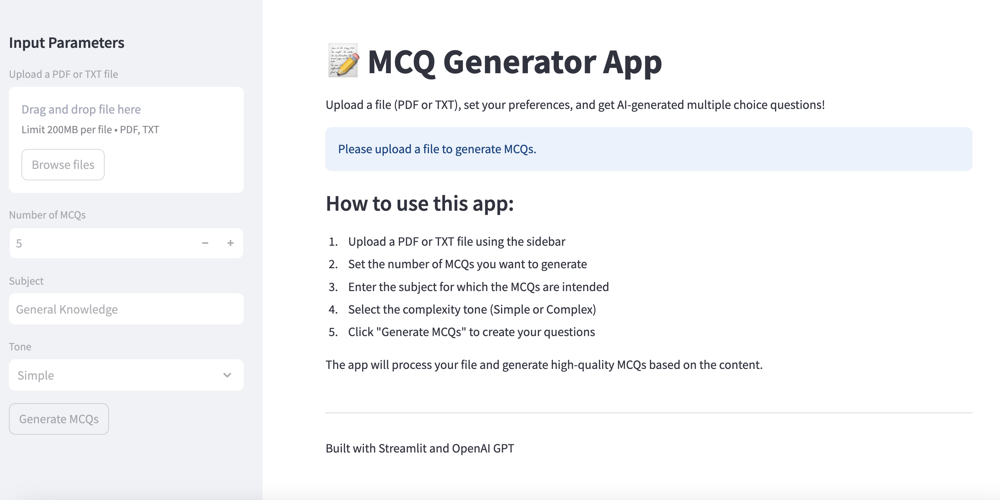

readme_content = """
# MCQ Generator

An AI-powered application that automatically generates multiple-choice questions from PDF and text documents.

---

## 📸 Screenshot


---

## ✨ Features

- **Automatic MCQ Generation**: Convert PDF and text documents into multiple-choice questions.
- **Customizable Output**: Control the number of questions, subject focus, and complexity level.
- **Expert Review**: AI evaluation of question quality and complexity.
- **Export Options**: Download generated questions in CSV or JSON format.
- **User-Friendly Interface**: Simple Streamlit web interface.

---

## ⚙️ How It Works

The MCQ Generator uses OpenAI's language models to analyze text content and create relevant multiple-choice questions. The application:

1. Extracts text from uploaded documents.
2. Processes the content using language models.
3. Generates contextually appropriate questions and answer choices.
4. Provides an expert review of the generated questions.
5. Displays results in a clean, tabular format.

---

## 🛠️ Installation

### Prerequisites

- Python 3.8+
- OpenAI API key

### Option 1: Standard Installation

```bash
# Clone the repository
git clone https://github.com/yourusername/mcq-generator.git
cd mcq-generator

# Create a virtual environment
python -m venv venv
source venv/bin/activate  # On Windows: venv\\Scripts\\activate

# Install dependencies
pip install -r requirements.txt

# Set up environment variables
echo "OPENAI_API_KEY=your_api_key_here" > .env
